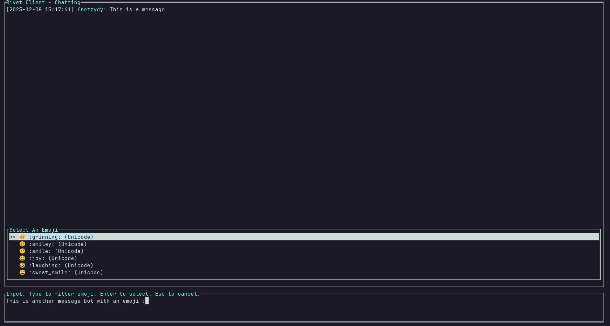

# Rivet

> A terminal UI Discord client written in Rust.



<p align="center">
  <a href="https://aur.archlinux.org/packages/rivetui">
    </a>
  <a href="https://crates.io/crates/rivetui">
    </a>
  <a href="https://crates.io/crates/rivetui">
    </a>
  <a href="https://github.com/YetAnotherMechanicusEnjoyer/Rivet/blob/5392a5b9f8982187b02d11ccd94dcd952fee36b6/LICENSE">
    </a>
</p>
<p align="center">
  <a href="https://github.com/YetAnotherMechanicusEnjoyer/Rivet/actions/workflows/aur.yml">
    </a>
  <a href="https://github.com/YetAnotherMechanicusEnjoyer/Rivet/actions/workflows/rust.yml">
    </a>
  <a href="https://github.com/YetAnotherMechanicusEnjoyer/Rivet/actions/workflows/bin.yml">
    </a>
</p>

## About

Rivet is a terminal UI Discord client written in Rust.

For best visuals, install  [NerdFonts](https://www.nerdfonts.com/)

### Terms of Service Notice

> [!WARNING]
> Under no circumstances should you use a Discord User Token (also known as a self-bot token) with this software or any associated tools.

Discord's [Terms of Service (ToS)](https://discord.com/terms) explicitly prohibits the use of User Tokens for programmatic access or self-botting. Violation of these terms can lead to permanent termination of your Discord account.

> **Do not use self-bots or user-bots.** Each account must be associated with a human, not a bot. Self-bots put strain on Discord’s infrastructure and our ability to run our services. For more information, you can read our Developer Policies [here](https://discord.com/developers/docs/policy).

The developers, contibutors, and maintainers are not responsible for any consequences resulting from a user's violation of Discord's Terms of Service. You (the user) assumes all risk if you choose to ignore Discord's policies.

## Installation

### Arch Linux ([AUR](https://aur.archlinux.org/packages/rivetui))

Requires [YaY](https://github.com/Jguer/yay)

```bash
yay -S rivetui
# or
yay -S rivetui-git
```

### Binaries

Download prebuilt binaries from: [releases](https://github.com/YetAnotherMechanicusEnjoyer/Rivet/releases/)

### [Cargo](https://doc.rust-lang.org/cargo/)

Requires [Rust](https://www.rust-lang.org/tools/install) 

Make sure that `~/.cargo/bin` is in your PATH env variable.

#### With [crates.io](https://crates.io/crates/rivetui)

```bash
cargo install rivetui
```

### From Source

```bash
git clone https://github.com/YetAnotherMechanicusEnjoyer/Rivet
cd Rivet/
cargo build --release
```

Run:

```bash
./target/release/rivetui
```

## Configuration
Set your Discord token using one of the following:

### .env file
```env
DISCORD_TOKEN="your-token-here"
```

### Shell
```bash
export DISCORD_TOKEN="your-token-here"
```

### Inline
```bash
DISCORD_TOKEN="your-token-here" rivetui
```


## Usage

```bash
rivetui
```

or

```env
DISCORD_TOKEN="your-token-here" rivetui
```

## Licence

[](https://github.com/YetAnotherMechanicusEnjoyer/Rivet/blob/5392a5b9f8982187b02d11ccd94dcd952fee36b6/LICENSE)
